# Page screenshots

Full-page captures of every page in the new ISE site (local WordPress + Elementor build, 1440px wide).
Regenerate with `node scripts/screenshots.mjs` (needs `npm i puppeteer-core` and the local site running).

### Home
`/`

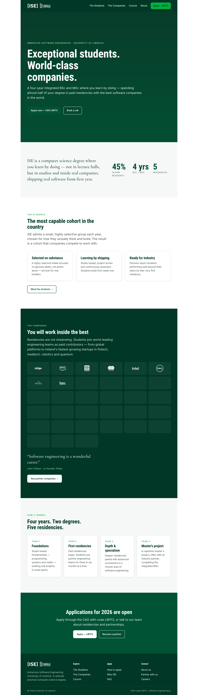

### The Students
`/students`

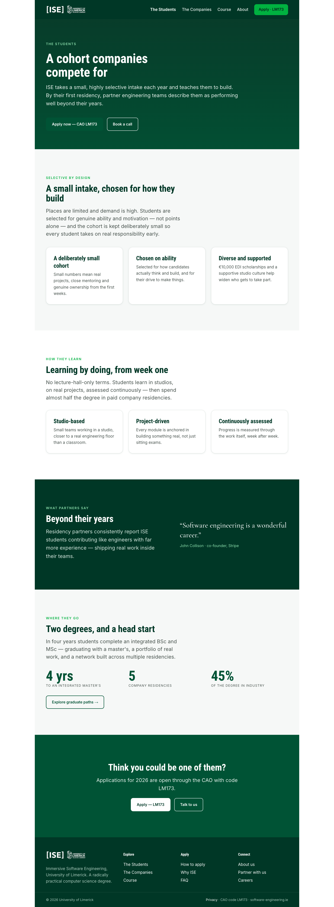

### The Companies
`/companies`

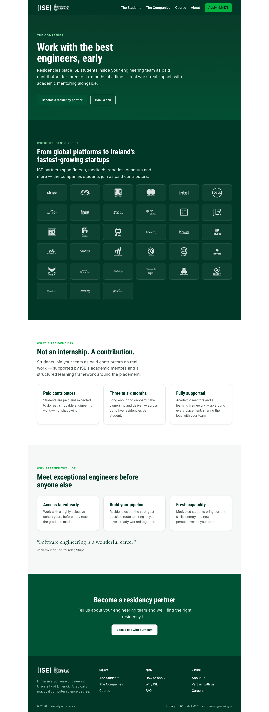

### Apply
`/apply`

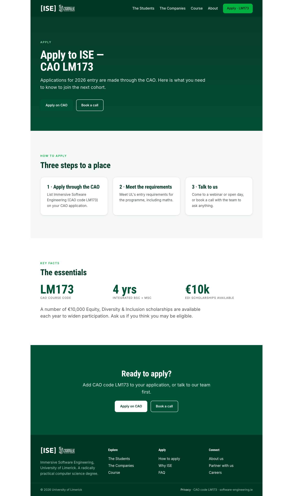

### Course
`/course`

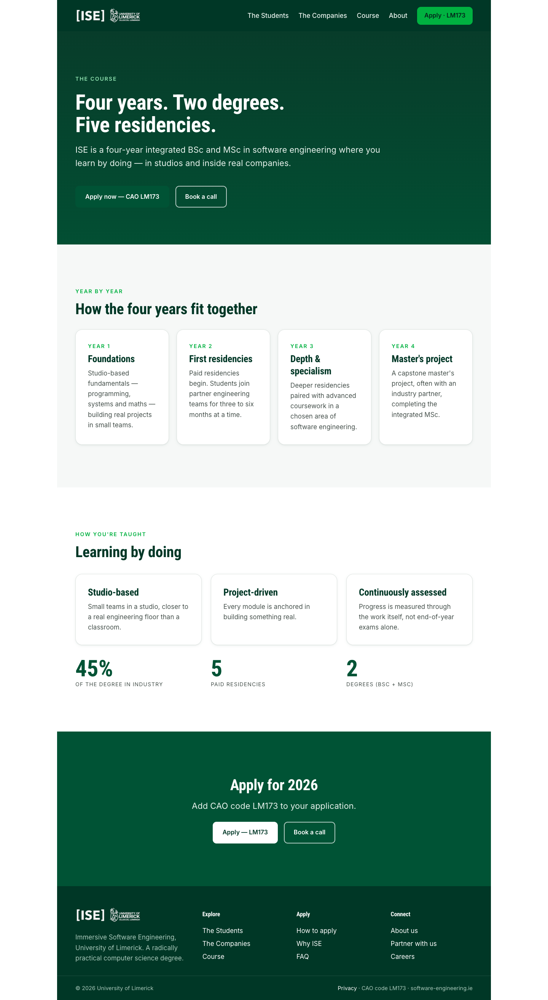

### Why ISE
`/why-ise`

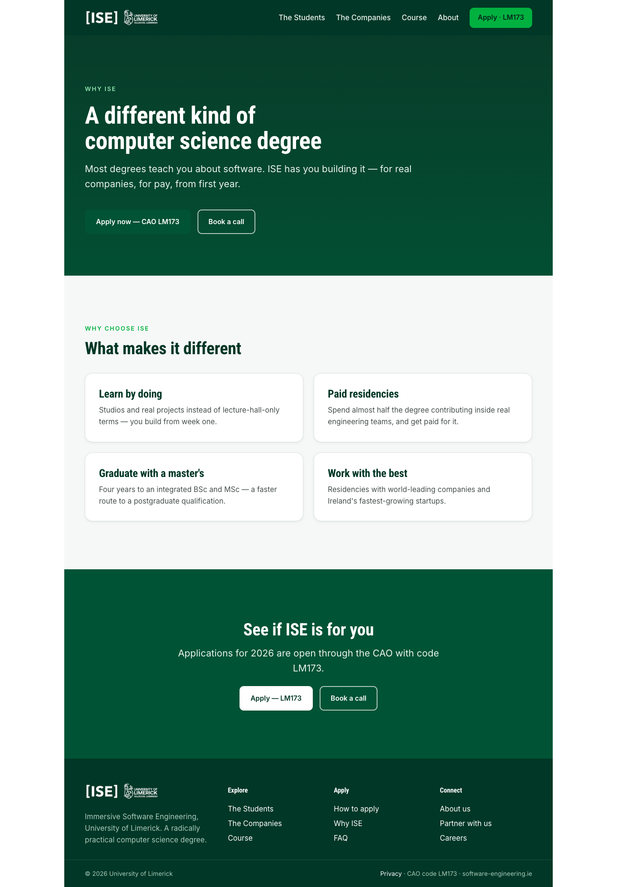

### About
`/about`

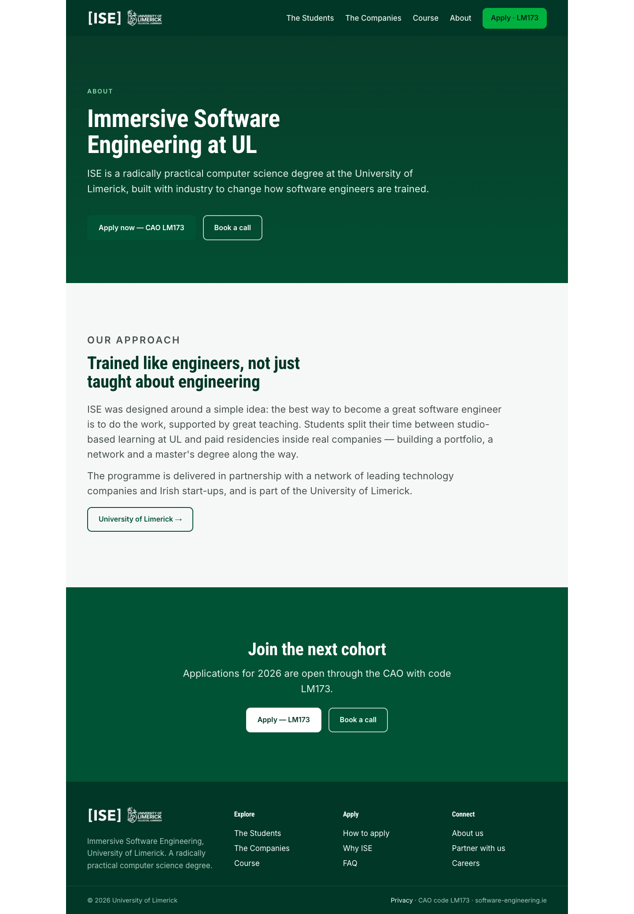

### FAQ
`/faq`

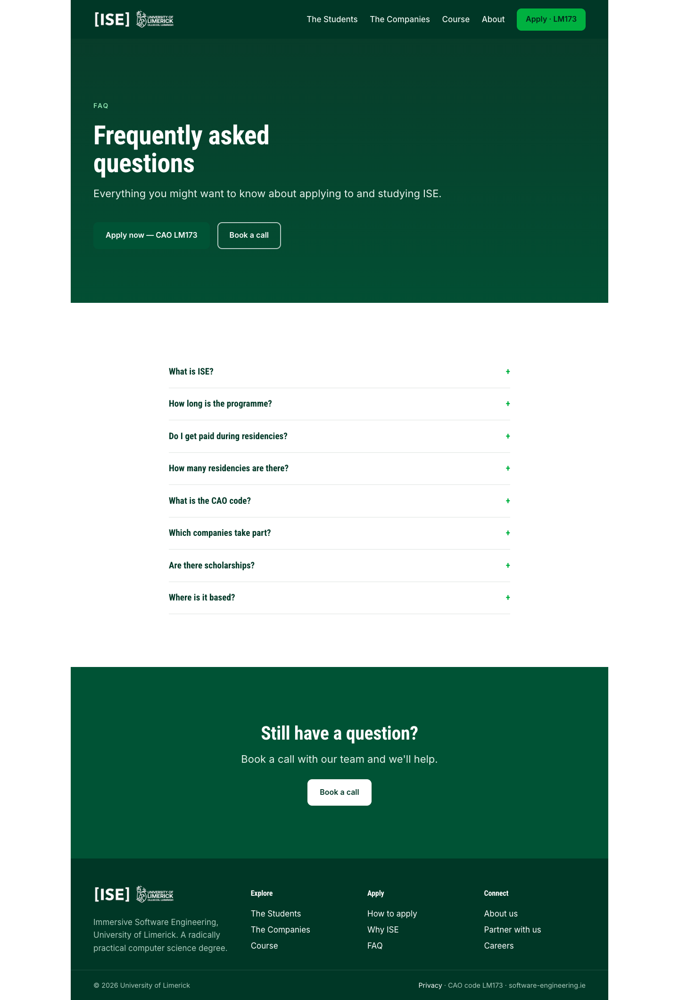

### Careers
`/careers`

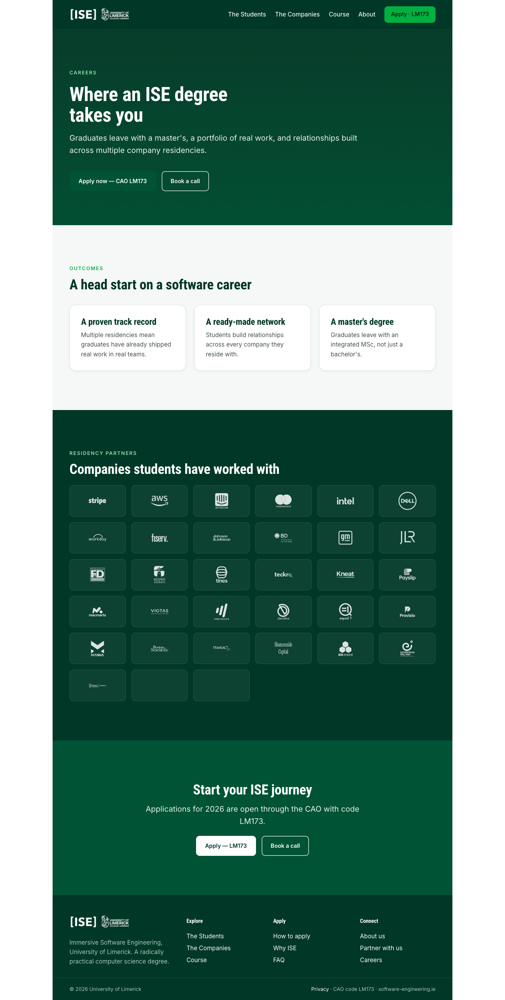

### Global Fellowships
`/global-fellowships`

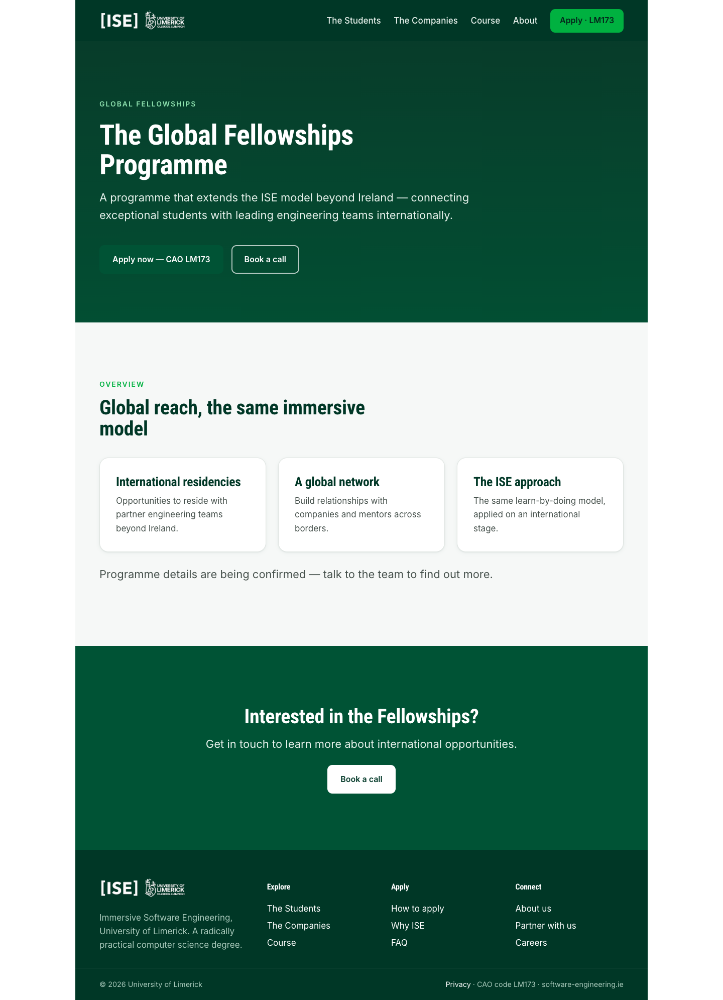

### EDI Scholarships
`/edi-scholarships`

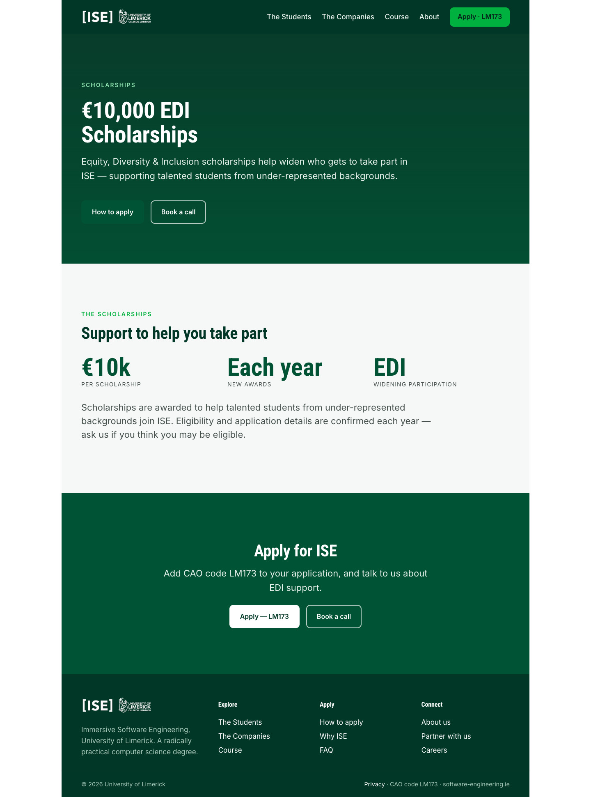

### For Schools
`/schools`

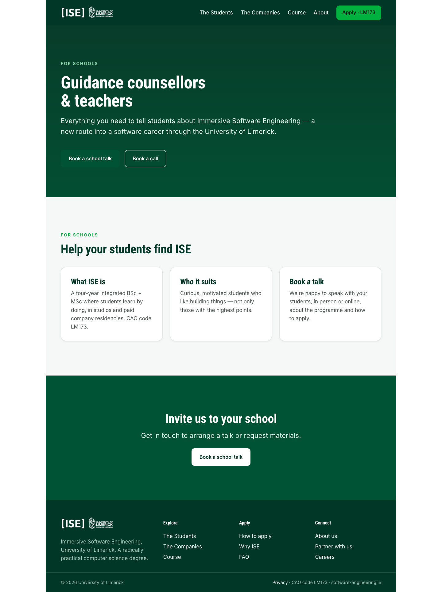

### Become a partner
`/become-a-partner`

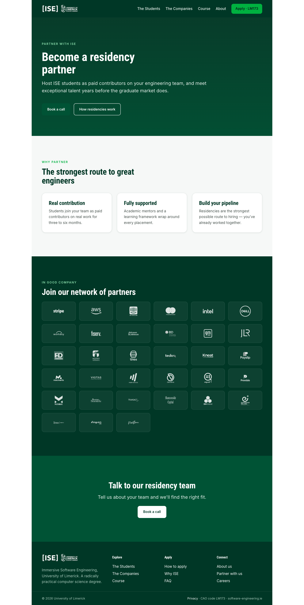

### Privacy
`/privacy`

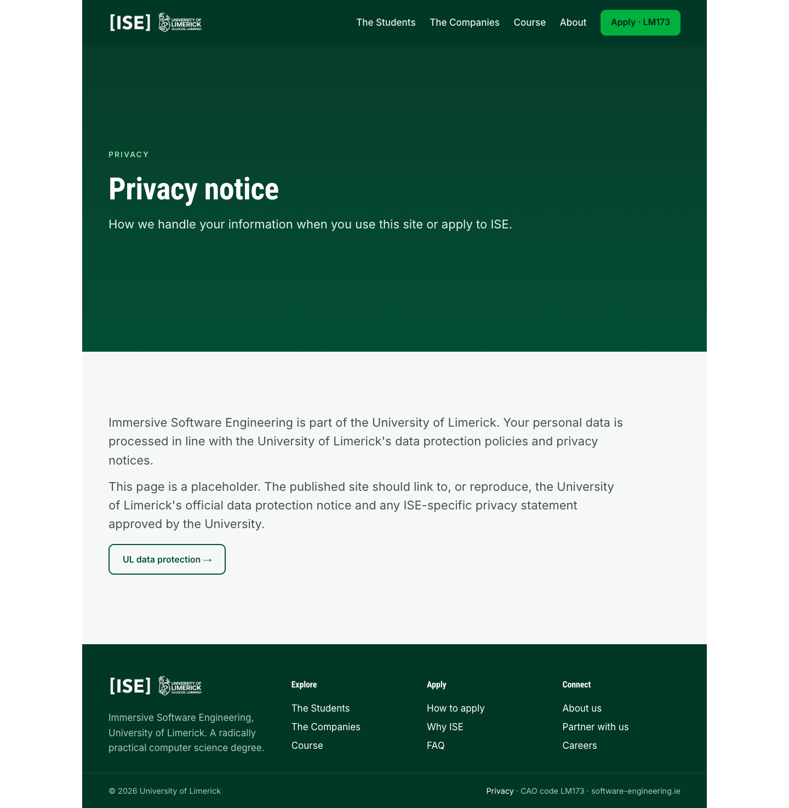
